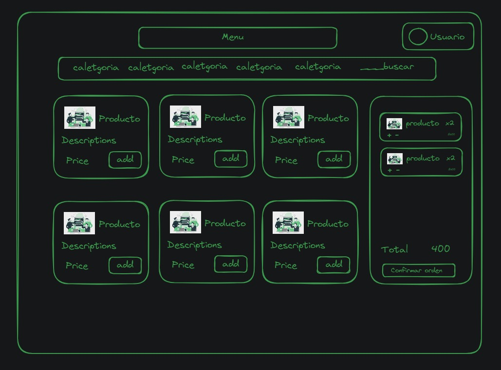
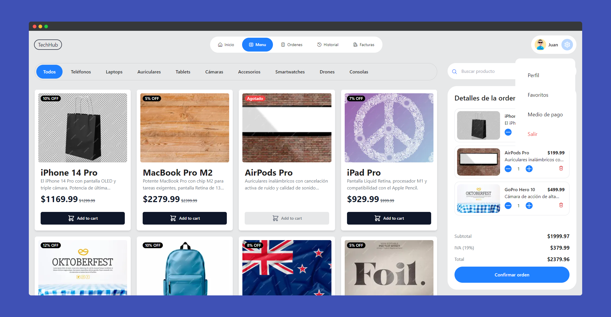
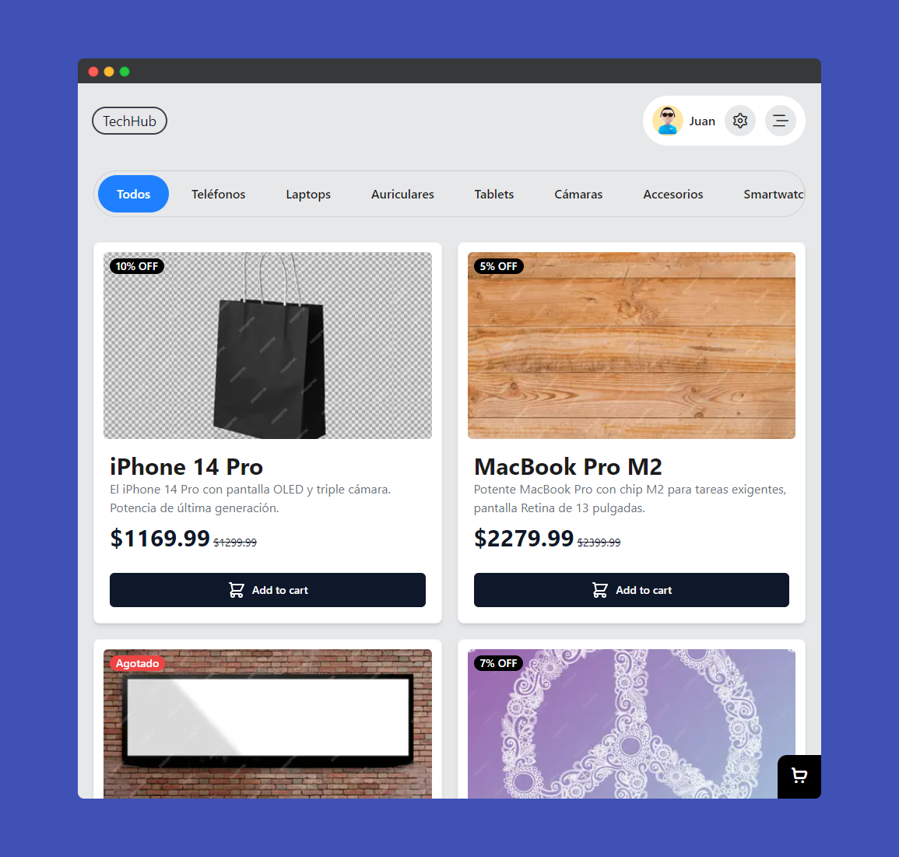
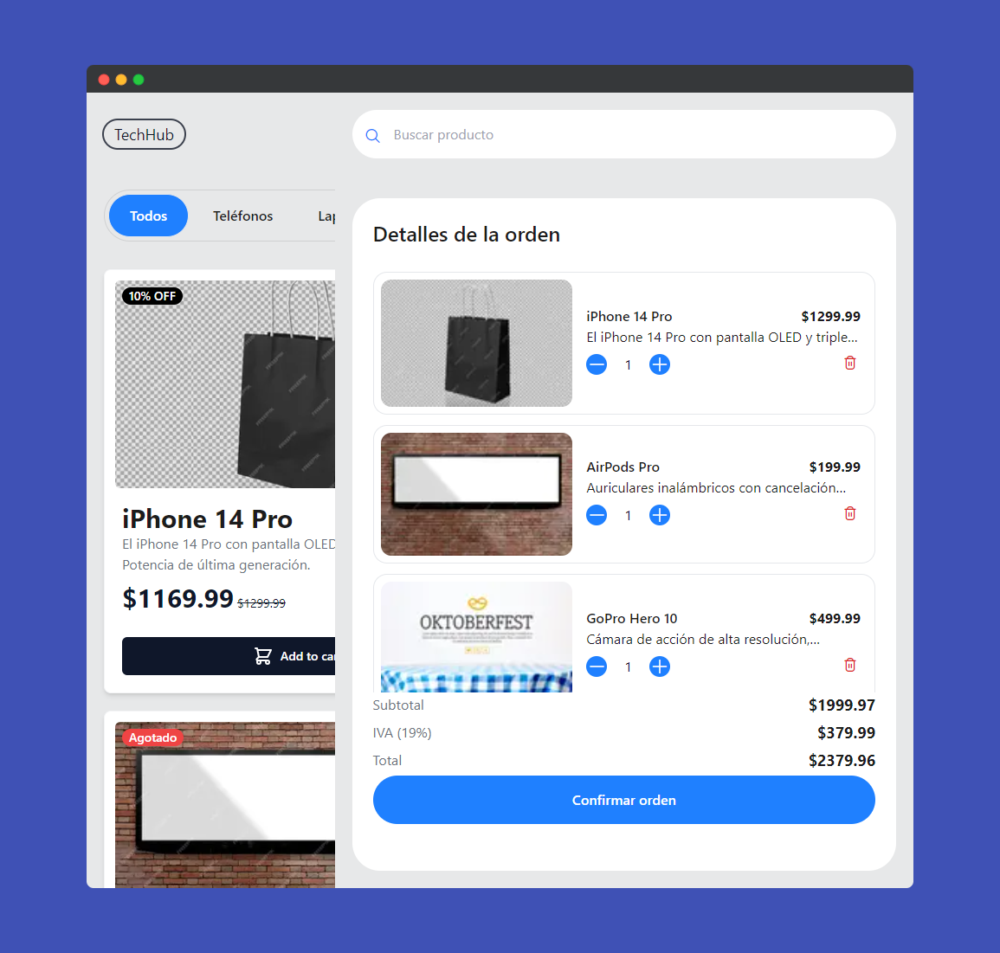

# TechHub E-commerce

Welcome to the **TechHub E-commerce** project! This is a modern, responsive online store built with [Next.js](https://nextjs.org) and [Tailwind CSS](https://tailwindcss.com). It showcases a range of technology products and is designed to be easily customizable for different types of products.


| **Next.js** | **JavaScript** | **Tailwind CSS** | **TypeScript** | **Flaticon** |
|:-----------:|:--------------:|:----------------:|:--------------:|:-----------------:|
|  |  |  |  |  |

## Version 1.0

This is the first version of the project, featuring a product grid, category menu, and cart management system. At this stage, the project is primarily focused on layout and design. 

## Project Overview

TechHub is a simple yet effective e-commerce platform that displays a list of products in a responsive grid layout. It includes:

- **Product Cards:** Each card displays product details including images, price, discount, and stock status.
- **Categories Sidebar:** Helps users navigate through different product categories.
- **Cart Sidebar:** Allows users to view and manage items added to their cart.

## Demo

You can check out the live demo of the project here: [TechHub Demo](https://techhub-alpha.vercel.app/)


## Initial Concept Sketch

Below is the initial concept sketch for the project, created in [Excalidraw](https://excalidraw.com/). 



*Note: The final implementation evolved from this sketch, but it was an essential part of the planning process.*


## Screenshots

Here are some screenshots of the project in both desktop and responsive views:

### Desktop View



### Responsive View
<div style="display: flex; justify-content: space-around; align-items: center; gap: 20px;">
  <div>
    <strong>Mobile</strong><br/>
    
  </div>
  <div>
    <strong>Mobile open cart</strong><br/>
    
  </div>
</div>

## Demo

You can check out the live demo of the project here: [TechHub Demo](https://techhub-alpha.vercel.app/)

## Getting Started

To get started with this project locally, follow these steps:

### 1. Clone the Repository

```bash
git clone https://github.com/JonathanVargas0111/techhub
cd techhub
```

### 2. Install Dependencies

Install the required dependencies using your preferred package manager:

```bash
npm install
# or
yarn install
# or
pnpm install
# or
bun install

```

### 3. Run the Development Server

Start the development server:

```bash
npm run dev
# or
yarn dev
# or
pnpm dev
# or
bun dev
```

### 4. Access the Project

Open your web browser and go to `http://localhost:3000` to view the project in development mode.

## Project Structure


- **`app/page.tsx`**: The main page that displays the product grid and categories sidebar.
- **`components/CardProduct.tsx`**: A component for displaying individual product cards.
- **`components/Categories.tsx`**: A sidebar component for product categories.
- **`components/Cart.tsx`**: A sidebar component for managing the cart.
- **`components/Header.tsx`**: A header component containing navigation and branding.

```
└── 📁src
    └── 📁app
        └── 📁(root)
            └── layout.tsx
            └── page.tsx
        └── 📁fonts
            └── GeistMonoVF.woff
            └── GeistVF.woff
        └── favicon.ico
        └── globals.css
        └── layout.tsx
    └── 📁assets
        └── data.ts
    └── 📁components
        └── CardProduct.tsx
        └── CardQuiantityProduct.tsx
        └── Cart.tsx
        └── Categories.tsx
        └── ConfigurationMenu.tsx
        └── Header.tsx
        └── index.ts
        └── Logo.tsx
        └── MenuMobile.tsx
    └── 📁utils
        └── productUtils.ts
        └── utils.ts
    └── types.d.ts
```

## Learn More

To learn more about Next.js, visit the following resources:

- [Next.js Documentation](https://nextjs.org/docs) - Learn about Next.js features and API.
- [Learn Next.js](https://nextjs.org/learn) - An interactive Next.js tutorial.

You can also check out the [Next.js GitHub repository](https://github.com/vercel/next.js) - your feedback and contributions are welcome!
